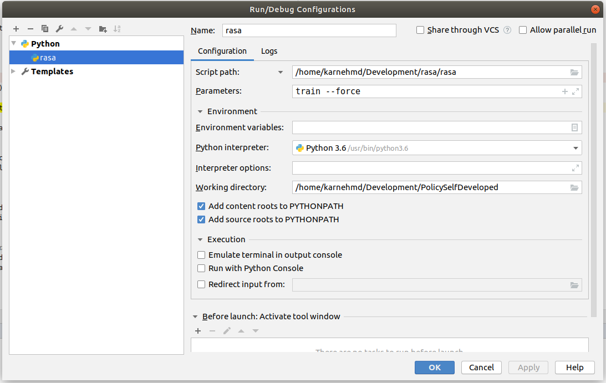

# Konfiguration für das Debugging

Ich habe mir zunächst die aktuelle Rasa Version vom Github [Repository](https://github.com/RasaHQ/rasa) geklont. Nun kann ich RASA selbst erweitern. Um es zu debuggen verwende ich ein kleines Projekt von mir selbst. Die Konfiguration für den Run erfolgte so: 



Nach einer Antwort im RASA-Forum habe ich herausgefunden, wie die korekte Implementierung einer eigenen Policy möglich ist. Der Import innerhalb der `config.yml` erfolgt über die Angabe des Pakets und der Klasse, also beispielsweise so `- name: "policy.my_policy.MyPolicy"`.Innerhalb des Packetes braucht man dann noch das `__init__.py` File. 
```python
# we need to import the policy first
from rasa.core.policies.policy import Policy

# and after that any implementation
from rasa.core.policies.ensemble import SimplePolicyEnsemble, PolicyEnsemble
```

Hat man das gemacht, kann auch die Konfig für das Debugging wieder geändert werden. 
# Policys

## Die Super-Klasse Policy

Alle Policys leiten sich von der `Policy` Klasse ab. Die Implementierung ist in `rasa/core/policies/policy.py` zu finden. Folgende Struktur hat die Klasse.

```python
class Policy:

    @staticmethod
    def _standard_featurizer() -> MaxHistoryTrackerFeaturizer:
       [...]

    @classmethod
    def _create_featurizer(cls, featurizer=None) -> TrackerFeaturizer:
        [...]

    def __init__(
        self,
        featurizer: Optional[TrackerFeaturizer] = None,
        priority: int = DEFAULT_POLICY_PRIORITY,
    ) -> None:
         [...]

    @property
    def featurizer(self):
        [...]

    @staticmethod
    def _get_valid_params(func: Callable, **kwargs: Any) -> Dict:
         [...]


    def featurize_for_training(
        self,
        training_trackers: List[DialogueStateTracker],
        domain: Domain,
        **kwargs: Any,
    ) -> DialogueTrainingData:
        [...]

    def train(
        self,
        training_trackers: List[DialogueStateTracker],
        domain: Domain,
        **kwargs: Any,
    ) -> None:
        [...]

    def predict_action_probabilities(
        self, tracker: DialogueStateTracker, domain: Domain
    ) -> List[float]:
        [...]

    def persist(self, path: Text) -> None:
        [...]

    @classmethod
    def load(cls, path: Text) -> "Policy":
        [...]
    
    @staticmethod
    def _default_predictions(domain: Domain) -> List[float]:
        [...]
```

## Einbindung neuer Policys 
Eine neue Klasse muss als Super-Klasse `Policy` implementieren. Des Weiteren muss die Policy unter `rasa/core/policies/registry.py` importiert werden. Erfolgt dies nicht, so erscheint bei Training folgende Fehlermeldung: 

```python
rasa.core.policies.ensemble.InvalidPolicyConfig: Module for policy 'MyMappingPolicy' could not be loaded. Please make sure the name is a valid policy.
```


## Eigenimplementierung

Um die erste eigene Policy zu implementieren habe ich die `KerasPolicy` kopiert und in `MyPolicy` umbenannt und in die Registry mit eingebunden. Das Ziel dieser eigenimplementierung ist das Erlangen über die Funktionsweise einer Policy um festzusellen, ob es überhaupt möglich ist im Rahmen der MA eine Policy zu implementieren. 

## `domain` Objekt
Das `domain` Objekt findet im Training verwendung. Wichtige Attribute dieses Objektes sind:

* `action_names`: Die Liste der Actions die innerhalb der Domain vorhanden sind. Es gibt Actions die defaultmäßig dabei sind. Das sind: `action_listen, action_restart, action_session_start, action_defaul_fallback, action_deactivate_form, action_revert_fallback_events, action_defauilt_ask_affirmation, action_defauilt_ask_rephrase, action_back`. 
* `num_actions`: Die Anzahl der Actions innerhalb der Domain. **Es sind grundsätzlich schon die 9 Standard-Actions vorhanden!**
* `èntities`
* `entity_states`
* `intent_states`:Die Intents, welche innerhalb `domain.yml` definiert sind. 
* `num_states` = `num_actions` + `len(intent_states)`
### Vorgehen

Um die Funktionsweise zu verstehen habe ich zunächst mit Debugging des Trainings begonnen. Zunächst ist innerhalb der `train` Methode die Variable `training_data` aufgefallen. Es handelt sich um ein Objekt mit den Arrays `X``und `Y`. In der Rasa-Dokumentation konnte ich folgendes dazu finden:

>  We use the X, y notation that’s common for supervised learning, where X is an array of shape (num_data_points, time_dimension, num_input_features), and y is an array of shape (num_data_points, num_bot_features) or (num_data_points, time_dimension, num_bot_features) containing the target class labels encoded as one-hot vectors. The target labels correspond to actions taken by the bot. To convert the features into vector format, there are different featurizers available:
> - `BinarySingleStateFeaturizer` creates a binary one-hot encoding: The vectors `X, y` indicate a presence of a certain intent, entity, previous action or slot e.g. `[0 0 1 0 0 1 ...]`.
> - `LabelTokenizerSingleStateFeaturizer` creates a vector based on the feature label: All active feature labels (e.g. `prev_action_listen`) are split into tokens and represented as a bag-of-words. For example, actions `utter_explain_details_hotel` and `utter_explain_details_restaurant` will have 3 features in common, and differ by a single feature indicating a domain. 

>   Labels for user inputs (intents, entities) and bot actions are featurized separately. Each label in the two categories is tokenized on a special character `split_symbol` (e.g. `action_search_restaurant = {action, search, restaurant}`), creating two vocabularies. A bag-of-words representation is then created for each label using the appropriate vocabulary. The slots are featurized as binary vectors, indicating their presence or absence at each step of the dialogue.

Quelle: [https://rasa.com/docs/rasa/api/core-featurization/#state-featurizers](https://rasa.com/docs/rasa/api/core-featurization/#state-featurizers)


Ich konnte folgende Struktur im Training erkennen:
1. Aufruf der Seed Methoden erzeugt mit einem [Deterministischen Zufallszahlengenerator](https://de.wikipedia.org/wiki/Zufallszahlengenerator#Pseudozufallszahlengenerator) nachvollziehbare Zufallszahlen als Startwerte für die Modelle. Dies erfolgt über die jeweiligen `seed`-Methoden. Die Wikipedia sagt dazu: 
    > Bei jedem Start der Berechnung mit gleichem Startwert (engl. seed, d. h. Saatkorn) wird die gleiche Folge erzeugt, weshalb diese deterministisch erzeugten Pseudozufallszahlen bei hinreichend genauer Dokumentation später reproduziert werden können. Diese Eigenschaft der Reproduzierbarkeit ist bedeutsam für die Anerkennung wissenschaftlicher Experimente.  
2. Mit dem Featurizer (`self.featurize_for_training`) die Vektoren für das Training erzeugen
    1. Das `X` und `Y` Array verfügt bei den Variablen über drei mögliche Zustände
        * -1: `None/undefined`
        * 0: `false`
        * 1: `true`
        
        Eine genauere Erläuterung aus der Dokumentation 
        >Given a dictionary of states (e.g. 'intent_greet',
        'prev_action_listen',...) return a binary vector indicating which
        features of `self.input_features` are in the bag. NB it's a
        regular double precision float array type.
        >
        > For example with two active features out of five possible features
        this would return a vector like `[0 0 1 0 1]`
        >
        > If intent features are given with a probability, for example
        with two active features and two uncertain intents out
        of five possible features this would return a vector
        like `[0.3, 0.7, 1.0, 0, 1.0]`.
        >
        > If this is just a padding vector we set all values to `-1`.
        padding vectors are specified by a `None` or `[None]`
        value for states. 
    2. Die Länge der zweiten Dimension der Arrays (`ǹdarray:(erste Dim, zweite Dim, dritte Dim)`) ist die Zeit und wird festgelegt über den Parameter `max_history` in `config.yml`.
    3. Es gibt mit `self.input_state_map` innerhalb der `Featurizers` Klasse ein Objekt, welches das Mapping von State zu Position im Array ermöglicht.
    
3. Die Reihenfolge der Vektoren im Array vermischen. Wahrscheinlich zur verbesserung der Ergebnisse. 
4. Modell erzeugen (`self.model_architekture(shuffled_X.shape[1:], shuffled_y.shape[1:])`)
5. Trainingsparameter ermitteln
6. Modell Trainieren 
  In diesem Fall, da ich Keras verwende wird die Methode `fit` der Keras-Bibliothek aufgerufen und das Training durch diese Ausgeführt. Hier hat bei der Entwicklung des eigenen Ansatzes ein anderes Vorgehen zu erfolgen.
  
  
# Importer

Es ist möglich Storys beim Import zu Manipulieren. Standardmäßig wird die Klasse `RasaFileImporter` für das Importieren von Storys verwendet. Um mein Ziel zu erreichen Chit-Chat in die Storys einzufügen habe ich eine Klasse `ChitChatImporter` implementiert, welche die Basisklasse erweitert. 


## Chitchat Dataset
Microsoft stellt auf GitHub eine große Sammlung an Chitchat zur verfügung. Das kann noch etwas proprocessed werden und kann daraufhin genutzt werden. Die notwendigen Befehle folgend:

```bash
echo '## intent:chitchat' > <output_file>
tail -n +2 <input_file>  | cut -f1 | sed -e 's/^/- /'  >> <output_file>
```

Quelle: [BotBuilder-PersonalityChat](https://github.com/Microsoft/BotBuilder-PersonalityChat/tree/master/CSharp/Datasets)

